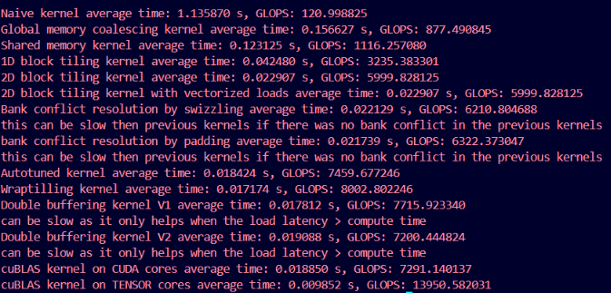

# Optimizing kernels:

## Final results:
Performed on a RTX 4060
For Matrix size : M x K x N = 4096 x 4096 x 4096<br>



## naive kernel
```
the most basic kernel that we write in the basic kernel section it is the slowest but we will try to optimize it.
such that we can reach the performance of cuBLAS.

in the naive kernel we fix a column of matrix B and then traverse through all the rows of the matrix A then we move to next column in matrix B and then traverse through all the rows again in matrix A
```

## Global memory coalesce
```
in this the orow remain the same and we instead traverse through the column bu this make it a bit faster as columns are laid out adjacent in memory and we dont need to skip through certain elements until we reach the next row thus making the operation s a bit faster.

in naive kernel:
the wrap with 32 thread with each thread finding one element of c
Thread0   row0 col0
Thread1   row0 col1
...
Thread15  row0 col15

Thread16  row1 col0
Thread17  row1 col1
...
Thread31  row1 col15

so in this 16 thread read the same adress and 16 thread read another adress

in this version we dont use threadId.y this means we dont divide wrap to calculate 2 rows instead we make a single wrap to calculate single row

GPU combines into one memory transaction this is called Memory Coalescing.

```
<b>Arrange threads so that every warp accesses contiguous global memory (coalesced memory access).</b>

## Shared memory chached blocking

```
register(8TB/s)  --> shared(1.5TB/s) --> global/local(200GB/s) --> host(5GB/s)

__shared__ : this is how we can use shared memory(program wise) and in hardware(L1 cache)

so will be using the method of tiling and as the tile blocks are short so we can easily put them on shared memory which is small but a lot fast thus making the process very fast

tiling : 

A = 1, 2, 3, 4                           B = 1, 2, 3, 4
    5, 6, 7, 8                               5, 6, 7, 8
    9, 10, 11, 12                            9, 10, 11, 12
    13, 14, 15, 16                           13, 14, 15, 16
                    
                       tile size = 2x2
tile 1        from A                              from B
              1, 2           \/                    1, 2    =   11, 14  
              5, 6           /\                    5, 6        35, 46

tile 2        from A                              from B
              3, 4           \/                   9, 10    =   79, 86
              7, 8           /\                   13, 14       167, 182

now the tile for C is:
addition of tile 1 and tile 2 output and more if they exist:
tile 1  for C is :  90, 100
                    202, 228

by this current calculation C matrix will be :  90 , 100 , _ , _
                                                202 , 228 , _ , _
                                                _ , _ , _ , _
                                                _ , _ , _ , _

lets verify this by base method 
for C00 = (1 * 1) + (2 * 5) + (3 * 9) + (4 * 13) = 90 # which is correct

now in this we see that we can find the matmul of two bigger matrices by doing matmul of the small matrices that are part of those bigger matrices by this we can do it faster as the whole bigger matrix cant be loaded on the L1 shared memory but these small matrices can be and are processed faster thus making the matmul faster.

and the first thread load it from global memory then store it in the shared memory other threads use it thus making the matmul faster also

in this a single thread computes one element of C and the block compute a complete tile of the C
```

## 1D Blocktiling for calculating Multiple Results per Thread
```
one block computes
BM x BN = 64*64 = 4096 outputs
but this dont mean it has 4096 threads
because TM = 8
this mean one thread compute 1 element 
this means instead of a single thread computing C10,5
it computes:
C10,5

C11,5

C12,5

C13,5

C14,5

C15,5

C16,5

C17,5

in this the row change but the column remain the same, TM(Thread Multiply) = 8 output/thread
so this means for number of thread per block = BM x BN / TM

now in this example we can see the the column dont change for a thread but the row change, in previous kernel we have 8 thread to calculate this and all of them readthe value which take more time now here we make it easy for it as one thread reads the value once and process 8 output thus reducing the read and write from the memory each time 
and this memory is also stored in register which is the fastest memory among the all whis makes its processing even faster

thread 0 --> C00                 thread 1 --> C01
             C10                              C11
             C20                              C21
             C30                              C31
             C40                              C41
             C50                              C51
             C60                              C61
             C70                              C71
```c
nvcc -ptx matmul.cu -o kernel.ptx
```
```
this command is used to see the ptx code that will be genrated by out script 
just view it using
```
```c
nvim kernel.ptx
```
```
we can also see the shader assembly file which actually run on gpu as ptx get compiled down to assembly code first by the command
```
```c
nvcc -cubin matmul.cu -o kernel.cubin
```
```
view it again using:
cuobjdump --dump-sass kernel.cubin
```
```
there we can see that there are a few LDS 32 which mean these ones are not coleased because for 4 column LDS 128 should be there 
this is a problem by 2d Block tiling
```

## Increasing Arithmetic Intensity via 2D Blocktiling
```
in the last implementation the problem was that in a thread we load one column of the B once but still the A is loaded multiple time like
A0 * B0
A1 * B0
A2 * B0
A3 * B0
A4 * B0
A5 * B0
A6 * B0
A7 * B0

this still calls the shread memory multiple time by this causing a slowness in the running of the kernel

now in the 2d tiling one thread calculate 8x8(TM x TN) results.

Lets visualize : 

so if the tiles are like

tile A : 1 2                                tile B : 5 6 
         3 4                                         7 8

then in 1D tiling the operation thread 0 will be            |           but in 2d tiling the operations will be 
                                                            |
        1×5 + 2×7                                           |                   1×5 + 2×7
        3×5 + 4×7                                           |                   1×6 + 2×8
                                                            |
thread 1 will do                                            |                   3×5 + 4×7
                                                            |                   3×6 + 4×8
        1×6 + 2×8                                           |                   
        3×6 + 4×8                                           |                   

so the benefit is that in 1d two thread loads the same data [[1, 2],[3, 4]] in both the thread this take extra time as the shared memory is slow

but in 2d tiling both of them loaded and a single thread perform everthing thus saving time as read and write operations are only done once.
```
```
outermost loop loops the tiles of the blocks and then .
second loops are used to matrix multiple of these tiles.
```

## Vectorize SGEMM and GEMM access
```
now the next bottle neck that we have is the movment of data from global memory to shred memory

suppose we have 
1 2 3 4

without vectorization every thread loads
Thread 0 -> 1

Thread 1 -> 2

Thread 2 -> 3

Thread 3 -> 4

GPU executes 
load float
load float
load float
load float

4 times same operation

instead GPU support float4 which is litrally where 1, 2, 3, 4 are packed together 
so now

Thread 0

↓

load float4

1 isntruction instead of 4

so this reduces the instructions by 75% which provides the speed increase

so now everywhere we just load it such that we have 4 item combined together 

as if a = float4 then it will have
a.x, a.y, a.z, a.w --> consist the memory adress of the 4 memory that are packed together.
```

## Bank Conflict Resolution using Swizzling (Linearization)

```
The main idea of swizzling (or linearization) is to deliberately rearrange
how elements are stored in shared memory so that threads in the same warp
access different memory banks simultaneously.

Instead of storing the matrix in the normal row-major order, the elements
are rearranged into a different layout. The values themselves do not change—
only their locations in shared memory change.

This spreads accesses across the 32 shared memory banks, reducing or
completely eliminating bank conflicts and allowing all threads in a warp
to read simultaneously.

Normal shared memory layout:

1  2  3  4
5  6  7  8
9 10 11 12
13 14 15 16

One possible swizzled (linearized) layout:

1  5  9 13
3  7 11 15
2  6 10 14
4  8 12 16

(The exact layout depends on the swizzling algorithm used.)
```

**Note:**
- Swizzling **does not move accesses farther apart in time**. All threads still access shared memory **at the same time**.
- Instead, it changes the **memory addresses** so that simultaneous accesses go to **different shared memory banks**, allowing them to execute in parallel.
- If the original kernel already has very few or no bank conflicts, swizzling can slightly reduce performance because of the extra index calculations and more complex memory layout.

## Resolve bank conflict using padding
```
in mordern nvidia GPU Have 32 banks

one bank can serve one adress per clock cycle

suppose we have

32 threads

↓

Shared Memory

ideal case :

Thread0 → Bank0

Thread1 → Bank1

Thread2 → Bank2

...

Thread31 → Bank31

all happen simultaneously in 1 clock cycle

but in case of bank conflict

Thread0 → Bank5

Thread1 → Bank5

Thread2 → Bank5

Thread3 → Bank5

The hardware cannot serve them together thus a conflict occur

this can only happen if provide more then 32 threads to a single shared memory as then there will be only 32 banks but more threads to process then conflict will arise.

to solve this we add a padding means another layer 
so adress become 
0

9

18

27

36

45

instead of
0

8

16

24

32
now the modulo32pattern changes and the conflict can be resolved as now they dont fall in same bank as before.

another technique is to change 
As[row][col] to As[col][row]
as this changes the memory banking thus solving the problem 

this reducess shared memory serialization
```
***Note: this can cause a downfall in the GFLOPS if there was no bak conflict actually***

## Autotuning
```
it is now a optimization rather we just test diffrent values for the same previously used kernel and see what is the best performing one is
```

## wraptiling
```
all the previous optimization was making the memory fast 
but this is about making the computation fast

instead of optimizing thread or blocks we use wraps(32 thread)

the scheduler never schedule one thread alone instead it shedule 32 thread together

before wrap was computing a random part of C but now lets give the wrap 64x64 or 128x128 of C

now a wrap owns a entire rectangle

Before:

let say block compute 128x128 there thread were scatter and each of them computes 8x8 with not much cordination beyond shared memory

now :

we divide the block 
128x128

+---------+---------+
| Warp 0  | Warp 1  |
+---------+---------+
| Warp 2  | Warp 3  |
+---------+---------+

for wrap owns 64×64

the thread still computes 8*8

this is faster as if a wrap calculate 64x64 then the threads in side it will be using A vlues and B values multiple time 

gpu executes wraps not threads, less shared memory traffic as

before
Shared Memory

↓

Registers

↓

Compute

now
Shared Memory

↓

Warp registers

↓

Many computations

better arthematic intensity:
Without warp tiling

Load A

↓

32 FMAs

With warp tiling

Load A

↓

256 FMAs

Better cache locality: entire wrap works on the same area

now for this whole wrap calculation where all the thread of the wrap reads the same memory we store all the data in a shared memory which can be accessed by all the threads in a wrap

before in 2D tiling :
Each thread repeatedly does
Shared Memory
      ↓
Registers
      ↓
64 multiplications
After finishing those 64 multiplications,
the registers are empty again
Then the next iteration
Shared Memory
      ↓
Registers
      ↓
64 multiplications
Every thread performs this independently.

this consumes a lot of time 

in wraptiling instead of all threads working independently the wrap become a single worker

so all the threads can compute through same shared memory

Global Memory
      │
      ▼
Shared Memory  (one copy per block)
      │
      ▼
Each thread loads only the values it needs
into its own registers
      │
      ▼
Registers perform thousands of multiplications/additions

in 2D tiling :
Load registers

↓

Compute one 8×8 tile

↓

Need new register values

in wrap tiling :
Load registers

↓

Compute tile #1

↓

Still have register values

↓

Compute tile #2

↓

Still have register values

↓

Compute tile #3

↓

Only then load again


Thread 0 loads

regM = [A0...A7]
regN = [B0...B7]

But instead of using them for one small tile, those values contribute to multiple subtiles of the warp tile.

Imagine the warp tile is divided like this

64×64 Warp Tile

+---------+---------+
| Tile 1  | Tile 2  |
+---------+---------+
| Tile 3  | Tile 4  |
+---------+---------+

The same registers help compute

Tile 1
Tile 2
Tile 3
Tile 4

before loading new values.

Even better visualization

Suppose

regM

1
2
3
4
5
6
7
8

and

regN

10 20 30 40 50 60 70 80

In 2D tiling

you compute

1×10
1×20
...
8×80

That's one 8×8 output tile.

In warp tiling,

those same values are also used while the warp moves over different warp subtile positions.

So

regM

1
2
3
4
5
6
7
8

might be multiplied with

B columns 0-7

then later

B columns 8-15

without immediately reloading regM.

Likewise regN can be reused while different rows are processed.
```

```
wt::loadFromGmem():
Load one BK tile of A and B from global memory → shared memory.

wt::processFromSmem():
Shared Memory
        ↓
Registers
        ↓
Matrix Multiply
        ↓
threadResults[]

sgemmWarptiling(): controll everything
for every BK tile

      ↓

loadFromGmem()

      ↓

__syncthreads()

      ↓

processFromSmem()

      ↓

advance pointers

repeat

finally:
threadResults[]

↓

store into C
```

## double buffring 
```
before double buffring:
Load tile from Global Memory
        ↓
Store into Shared Memory
        ↓
__syncthreads()

        ↓
Compute using Shared Memory

        ↓
__syncthreads()

        ↓
Load next tile

the GPU does:
LOAD
STOP

COMPUTE
STOP

LOAD
STOP

COMPUTE
STOP

so the idea is while we load tile 1 let the operations of the tile 0 start

this overlapp of the process in called pipelling

double buffer:
Shared Memory

Buffer A
+-------------+
| Tile 0      |
+-------------+

Buffer B
+-------------+
| Tile 1      |
+-------------+


Version 1 : Software double buffring
256 threads

0----------------127
compute

128-------------255
load

Version 2 : Hardware double buffring
every thread does both jobs. loading and multiplication
```